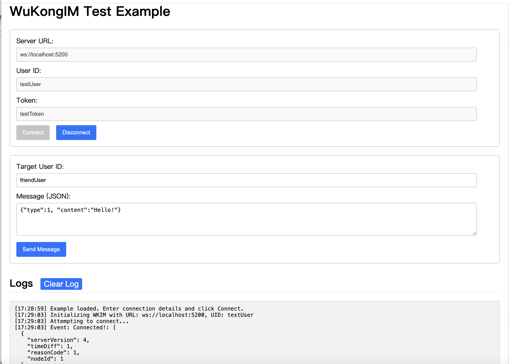

# EasyJSSDK

[中文 README](README_zh.md)

A simple and easy-to-use communication SDK for WuKongIM, based on its JSON-RPC protocol.

## Installation

```bash
npm install easyjssdk
```

## Usage

```typescript
// Import necessary components
import { WKIM, WKIMChannelType, WKIMEvent } from 'easyjssdk';

// 1. Initialization
const im = WKIM.init("ws://your-wukongim-server.com:5200", {
    uid: "your_user_id",
    token: "your_auth_token"
    // deviceId: "optional_device_id", // Optional
    // deviceFlag: 2 // Optional (1:APP, 2:WEB, default is 2)
});

// 2. Setup Event Listeners
im.on(WKIMEvent.Connect, (connectResult) => {
    console.log("IM Connected!", connectResult);
    // Connection successful, you can now send messages
});

im.on(WKIMEvent.Disconnect, (disconnectInfo) => {
    console.log("IM Disconnected.", disconnectInfo);
    // Handle disconnection (e.g., show message, attempt reconnect)
});

im.on(WKIMEvent.Message, (message) => {
    console.log("Received Message:", message);
    // Process incoming message (message.payload, message.fromUid, etc.)
});

im.on(WKIMEvent.Error, (error) => {
    console.error("IM Error:", error);
    // Handle errors
});

// 3. Connect to the server
im.connect()
    .then(() => {
        console.log("Connection process initiated. Waiting for Connect event...");

        // Example: Send a message after successful connection initiation
        const targetUserId = "friend_user_id";
        const messagePayload = { type: 1, content: "Hello from EasyJSSDK!" }; // Your custom payload

        return im.send(targetUserId, WKIMChannelType.Person, messagePayload);
    })
    .then((sendAck) => {
        console.log("Message sent successfully, Ack:", sendAck);
        // sendAck contains { messageId, messageSeq }
    })
    .catch((err) => {
        console.error("Connection or initial send failed:", err);
    });

// 4. Disconnect (when needed, e.g., user logout)
// im.disconnect();

```

## Example:



## Development

1. Clone the repository.
2. Run `npm install`.
3. Run `npm run build` to compile TypeScript to JavaScript.

## Running the Example

This repository includes a simple HTML/JS example to test the SDK.

1.  **Build the SDK:** Make sure you have built the library first:
    ```bash
    npm run build
    ```
2.  **Start a Local Server:** Navigate to the root directory of this project (`EasyJSSDK`) in your terminal. You need to serve the files using a local web server because the example uses ES Modules. A simple way is using `http-server`:
    ```bash
    # If you don't have http-server, install it globally:
    # npm install -g http-server

    # Run the server from the EasyJSSDK directory:
    http-server .
    ```
    Alternatively, use the VS Code "Live Server" extension or any other local server, ensuring it serves from the project root directory (`EasyJSSDK`).

3.  **Open the Example:** Open your web browser and navigate to the example page, typically:
    `http://localhost:8080/example/`
    (Adjust the port number if your server uses a different one).

4.  **Test:** Enter your WuKongIM server details (URL, UID, Token) and use the buttons to connect, disconnect, and send messages. 

